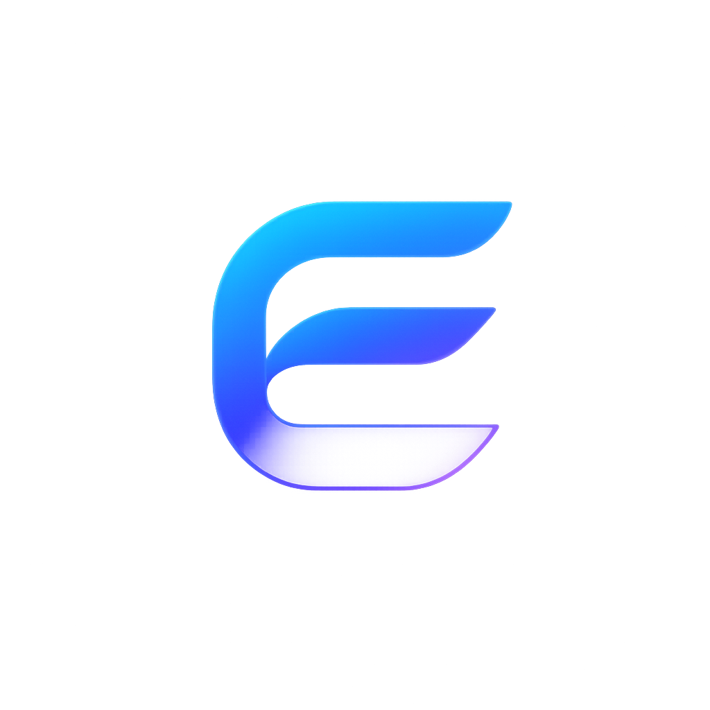

<div align="center">
  
  <h1>Edge Go</h1>
  <p><strong>A sleek, always-on-top floating HUD bar built seamlessly for Windows.</strong></p>
</div>

---

## 🌟 Overview

**Edge Go** is a beautiful, interactive desktop overlay for Windows that brings essential information and controls right to the top edge of your screen. Stay focused with integrated media controls, system metrics, and quick settings—all wrapped in a premium, customizable UI.


## ✨ Features

- **Seamless Desktop Integration**: Snaps to the top of your screen for a native look.
- **Global Keyboard Shortcuts**: 
  - `Win + Alt + E`: Quickly show or hide the Edge Go bar.
  - `Win + Alt + S`: Open the Settings panel instantly from anywhere.
- **Interactive Media Player**: Control your music and visualize audio playback.
- **Customizable Appearance**: Change accent colors, blur intensity, size, and widgets.
- **Ambient Glow**: Dynamic effects that respond to your environment.
- **System Metrics**: Quick access to battery and clock widgets.

## 🚀 Installation

You can download the latest installer from the [Releases](https://github.com/varshithdondamuri-pixel/Edge-go/releases) page.
1. Download `Edge Go Setup.exe`.
2. Run the installer.
3. Edge Go will launch automatically and can be configured to start with Windows!

## 🤝 Community

Join our community to report bugs, suggest features, or just hang out!

[](https://discord.gg/edgego)
## 🛠️ Development Setup

If you'd like to build Edge Go from source or contribute:

1. Clone the repository:
   ```bash
   git clone https://github.com/varshithdondamuri-pixel/Edge-go.git
   cd edge-go
   ```
2. Install dependencies:
   ```bash
   npm install
   ```
3. Start the development server:
   ```bash
   npm run dev
   ```
4. Build for production (Generates Windows EXE):
   ```bash
   npm run dist
   ```

## 📜 License

MIT License. See `LICENSE` for details.
